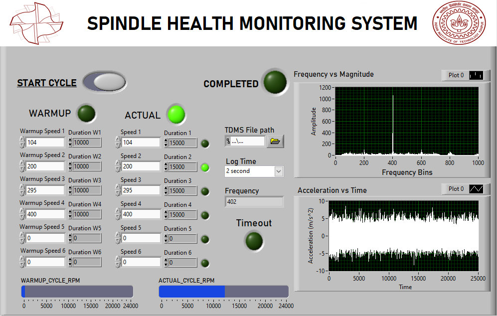
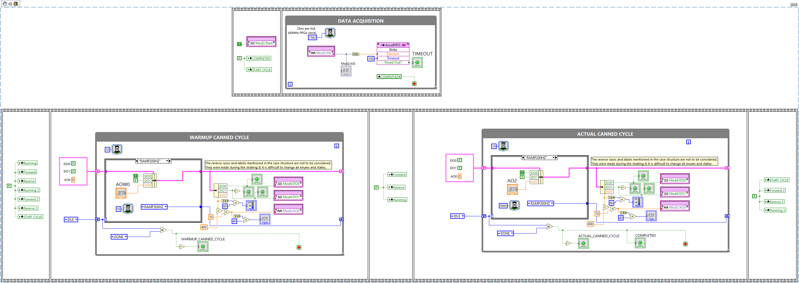
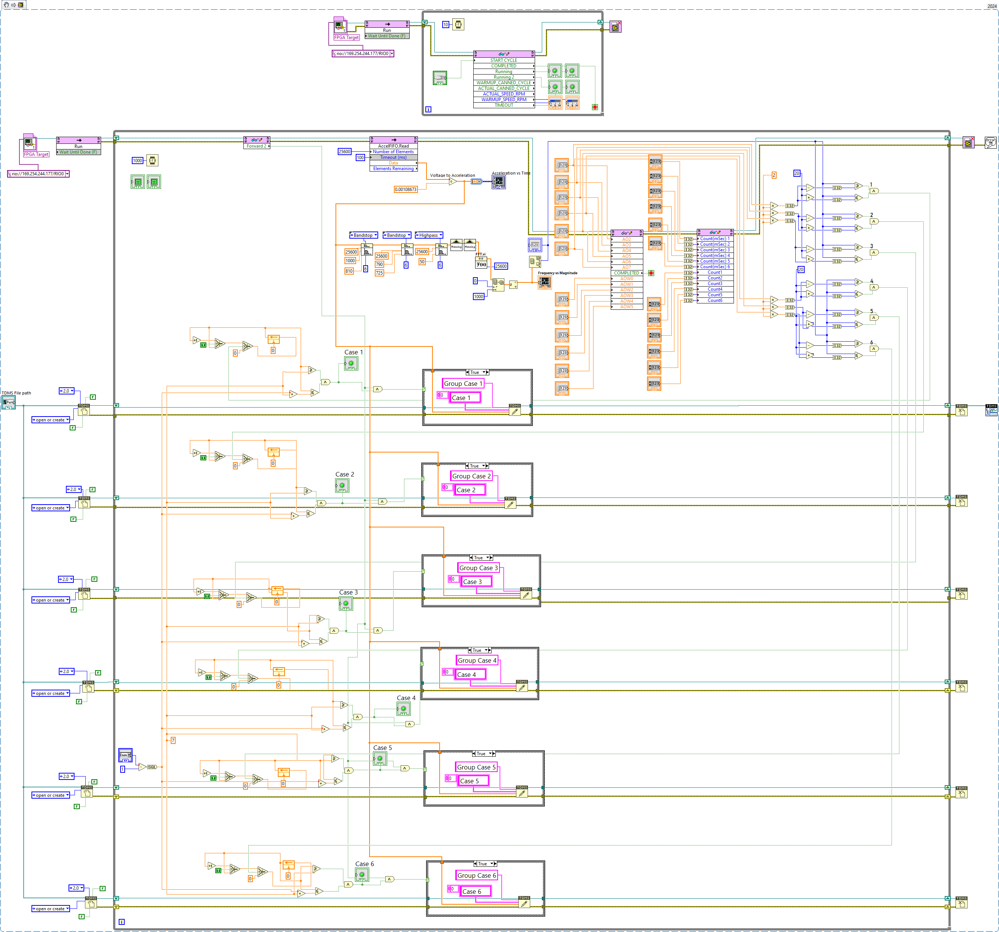
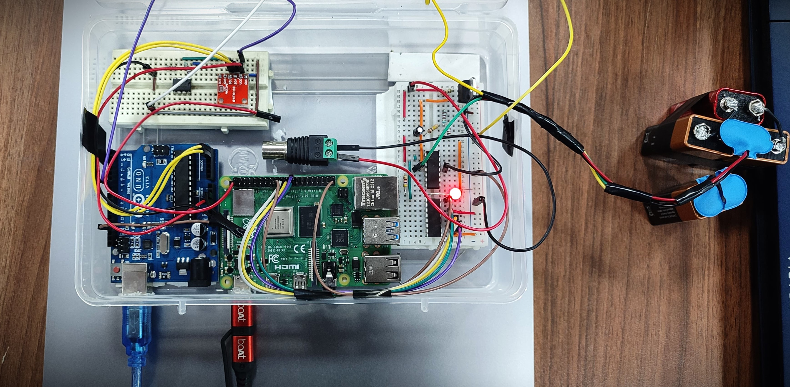
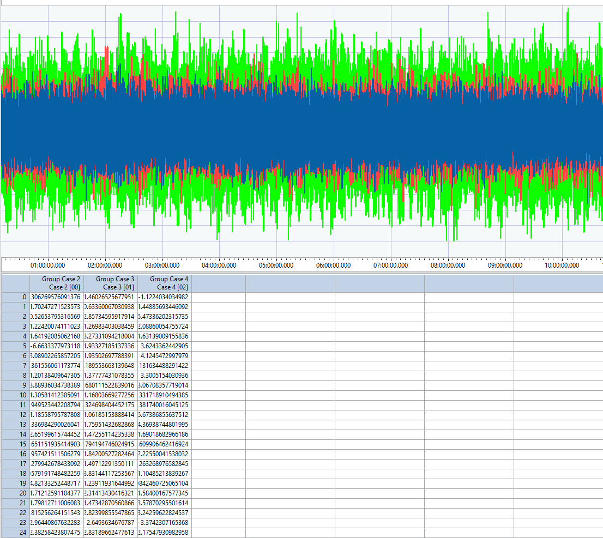
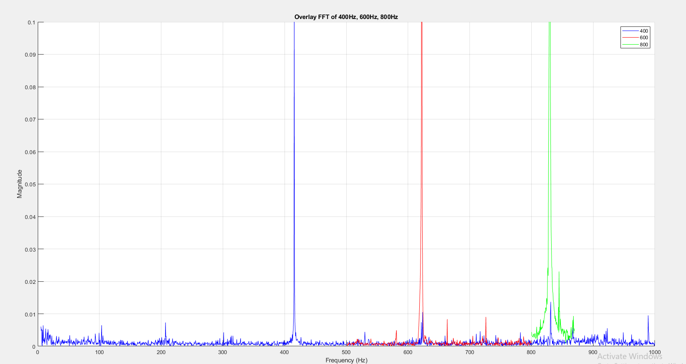
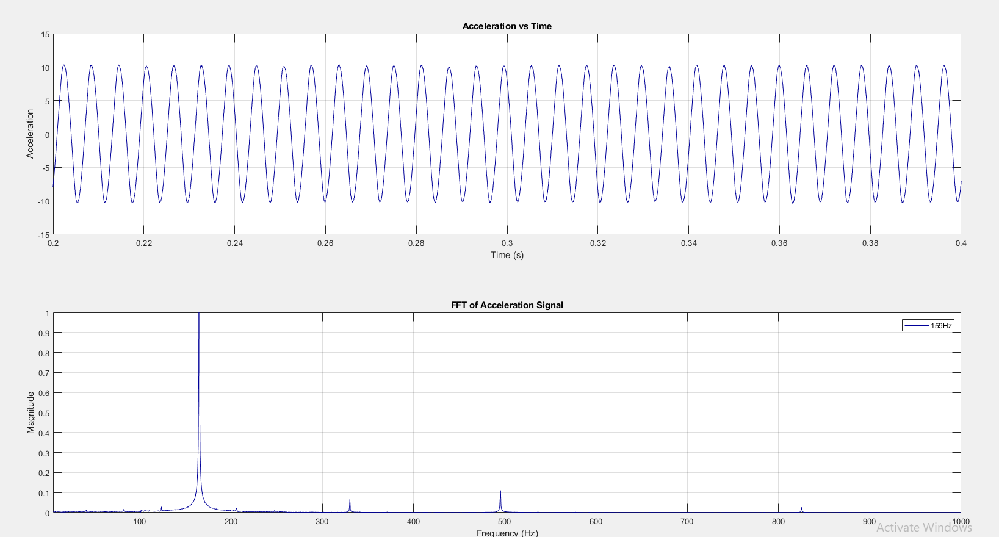
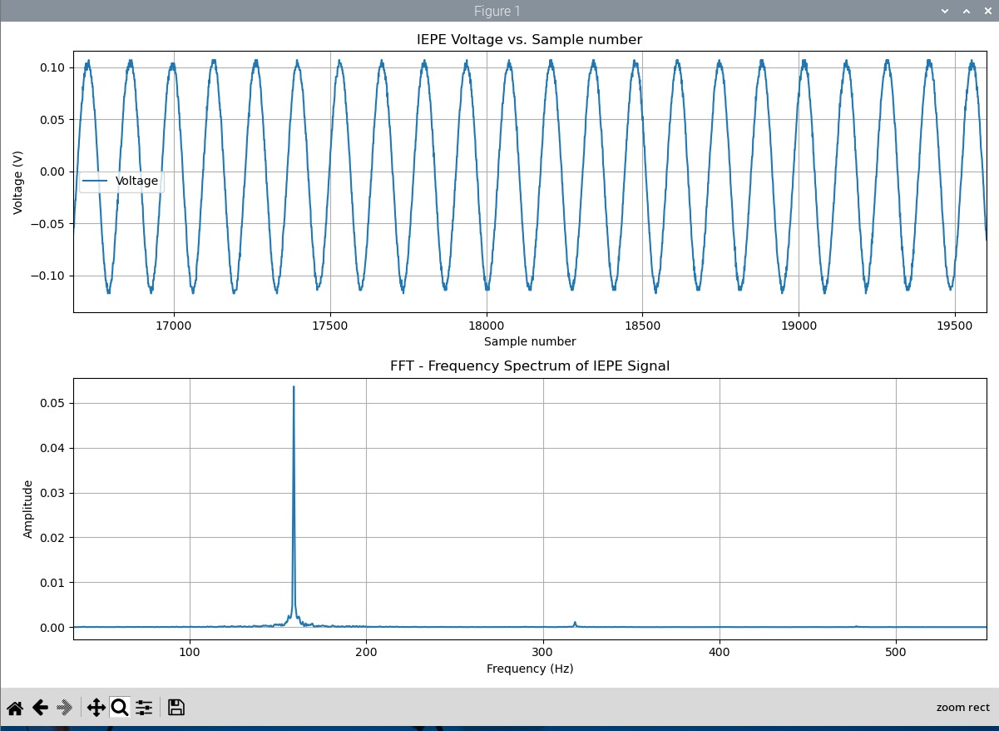

# Smart Spindle Health Monitoring System
**A dual-approach spindle health monitoring solution — combining industrial-grade NI CompactRIO + LabVIEW control with a cost-effective Raspberry Pi platform for real-time vibration-based fault detection and predictive maintenance.**

---

## 📌 Overview
Modern CNC spindles are critical to manufacturing precision, yet prone to faults like imbalance, misalignment, and bearing wear.  
This project presents **two complementary approaches** to spindle health monitoring:

1. **Industrial-Grade Setup** — **NI CompactRIO + LabVIEW** with FPGA and RT modules for multi-channel, high-frequency data acquisition and real-time fault detection.
2. **Low-Cost Setup** — **Raspberry Pi + MCP3208 ADC** with custom IEPE signal conditioning and Python-based analysis for budget-friendly, single-channel diagnostics.

**Core Capabilities:**
- **Real-time FFT analysis** for frequency-domain fault detection.
- **Thermal warm-up cycle** before acquisition to ensure stable readings.
- **Automated triggering** at specific spindle speeds to reduce unnecessary data storage.
- **Adaptable design** for both high-end industrial use and cost-sensitive environments.

---

## 🖥 LabVIEW System Interface

---

## 🔧 System Architecture

**LabVIEW FPGA Block Diagram**  

**LabVIEW PC Control Block Diagram**  

---

## 📡 Hardware Setup

**Raspberry Pi + Arduino Schematic**  

**LabVIEW CompactRIO Wiring Diagram** *(PDF in repo)*  
📄 [`schematics/LabVIEW_cRIO.pdf`](schematics/LabVIEW_cRIO.pdf)  

**Raspberry Pi Circuit Diagram** *(PDF in repo)*  
📄 [`schematics/RaspberryPi_Arduino.pdf`](schematics/RaspberryPi_Arduino.pdf)

---

## 📊 Results Showcase

### 📈 Signal Analysis Results

**Spindle Vibration Signal**  

**Frequency Spectrum Example**  

### ⚖️ Benchmarking High Precision LabVIEW setup with Compact & Cost-effective setup

**Calibrometer Output – LabVIEW**  

**Calibrometer Output – Low-cost System**  

---

## ⚖️ Detailed System Comparison

| Parameter | CompactRIO (LabVIEW) | Raspberry Pi |
|-----------|----------------------|--------------|
| **Data Acquisition Hardware** | NI CompactRIO 9040 with NI 9234 (IEPE vibration), NI 9263 (analog output), NI 9375 (digital I/O) | Raspberry Pi with MCP3208 10-bit ADC |
| **Sampling Rate** | Up to 51.2 kS/s per channel (multi-channel) | ~25.6 kS/s (single channel) |
| **Number of Channels** | Multi-channel (expandable via NI C-Series modules) | Single-channel per ADC (multiple MCP3208 chips possible) |
| **Signal Conditioning** | Direct IEPE sensor interface via NI 9234 with built-in current excitation | LM317-based constant current source, AC coupling, TL072 op-amp buffer |
| **Processing** | FPGA-based real-time data handling + RT processor FFT analysis | Python-based FFT and threshold detection |
| **Triggering** | FPGA-controlled, speed-specific automated data logging | Software-based amplitude threshold triggering |
| **Thermal Warm-Up** | Automated spindle warm-up sequence before acquisition | Automated spindle warm-up sequence before acquisition |
| **Accuracy** | High precision, low noise, industrial-grade | Good accuracy for general monitoring; slightly more noise than CompactRIO |
| **Scalability** | Supports multiple sensors and control outputs | Easily scalable by adding low-cost boards |
| **Cost** | High (industrial hardware) | Low (educational budget) |
| **Ideal Use Case** | Industrial CNCs, high-precision research | Educational, small workshops, distributed low-cost monitoring |

---

## 🙏 Acknowledgements
- **Indian Institute of Technology Kanpur**
- **Mentor:** Dr. Mohit Subhash Law

---

## 👨‍💻 Authors
- **Humayun Ahmad**  
- **Chanda Bhavitha Sri**  
- **Jainam Tated**  
